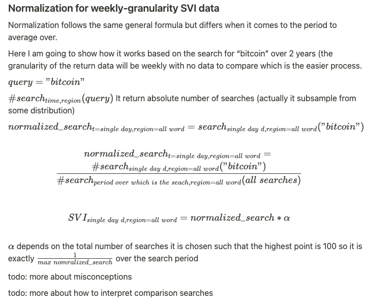

# Google Trends Data
## Aims
Explain:
* Google Trends, especially the normalization they apply
* recreation of daily data with meaningful scale (why and how)
* different approaches by other people and common mistakes
## Directly from Google
> Google Trends normalizes search data to make comparisons between terms easier. Search results are normalized to the time and location of a query by the following process:
>
>   * Each data point is divided by the total searches of the geography and time range it represents to compare relative popularity. Otherwise, places with the most search volume would always be ranked highest.
>   * The resulting numbers are then scaled on a range of 0 to 100 based on a topic’s proportion to all searches on all topics.
>   * Different regions that show the same search interest for a term don't always have the same total search volumes.

Source: [1]  
There are several issues with this kind of process but let's firstly undestand it.

## Explanation

The granularity of the $SVI$ result depends on the search period. Here is a table that shows this relationship:

| search period | granularity |
| --- | --- |
| < 4hour | minutely |
| < 1 day | 8 minutes |
| 1 day to 7 days | hourly |
| 7 days to 9 months | daily |
| 9 months to 5 years | weekly |
|  > 5 years | monthly |
| < 36 hours | no data available |

Table 1:  Search period to granularity.

Examples:

todo: put some examples

### Normalization for weekly-granularity SVI data

Normalization follows the same general formula but differs when it comes to the period to average over.

Here I am going to show how it works based on the search for “bitcoin” over 2 years (the granularity of the return data will be weekly with no data to compare which is the easier process.

## Resources
[1] https://support.google.com/trends/answer/4365533?hl=en-GB&ref_topic=6248052
